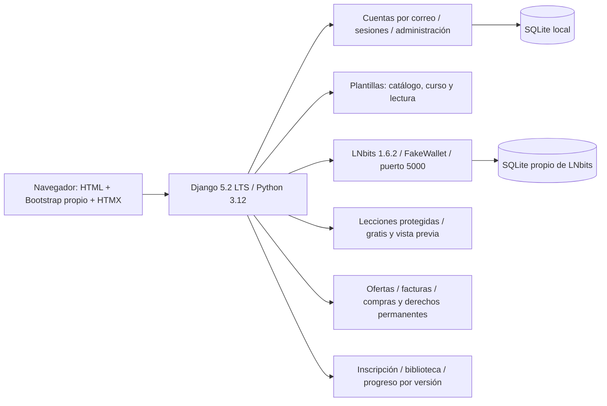

# BTC.EDU — plataforma educativa

Estado vigente al **4 de octubre de 2026** (Guatemala): ofertas revisadas con precios en sats de prueba, facturas integradas con LNbits FakeWallet, compras y derechos permanentes sobre revisiones, biblioteca, inscripción y progreso con continuación por versión. **129 pruebas pasan**, junto con concurrencia SQLite en archivo y compra real contra el proveedor ficticio. [Comportamiento, preparación y evidencia](docs/comercio-y-aprendizaje-2026-10-04.md). Los registros fechados siguientes conservan los estados anteriores.

Actualización de acceso del **3 de octubre de 2026**: cuentas independientes de creador y estudiante, registros, logins, perfiles y recuperación separados; el mismo correo puede pertenecer a identidades distintas. Estudio con navegación propia y aprobación de creador conservada. **96 pruebas pasan.** [Rutas, migración y límites](docs/cuentas-independientes-2026-10-03.md). Este bloque sustituye la cuenta compartida y la ausencia de registro público descritas en los registros anteriores.

Actualización al **3 de octubre de 2026** (Guatemala): estudio de creadores con solicitud/aprobación, perfil público, cursos/tutoriales/recursos propios, edición de temario, biblioteca de archivos, vista previa y revisión editorial. Enviar conserva una copia; aprobar publica exactamente lo revisado. **77 pruebas pasan.** Migración aplicada con respaldo y base real sin ejemplos. Entrar en `/crear/solicitud/` con una cuenta existente; aprobación desde administración. [Recorrido, demostración y pendientes](docs/estudio-creadores-2026-10-03.md). Compras, progreso y módulos educativos ampliados siguen pendientes. El párrafo siguiente conserva el estado del bloque anterior.

Estado al **2 de octubre de 2026** (Guatemala): academia industrial con cursos, selector, tutoriales y recursos; publicación de versiones selladas y revisiones reutilizables; archivos privados MP4/PDF/TXT/VTT, reproducción/subtítulos/transcripción y descarga autorizada. Carga/publicación disponibles en administración. Compras, acceso adquirido a versiones anteriores, inscripciones/progreso y panel de creador siguen pendientes. No se cargó contenido en la base real. **54 pruebas pasan.** Ver [contenido/versiones/archivos y límites](docs/contenido-versiones-y-archivos-2026-10-02.md) e [interfaz](docs/interfaz-academia-2026-10-02.md).

Todo el código, configuración, herramientas y documentación técnica vive en `/src`. Business y requisitos están en `/strategy`; los originales del assignment permanecen en `/docs`, sin modificaciones.

**Dirección de desarrollo definida el 2 de octubre:** academia con cursos, tutoriales y biblioteca de recursos; catálogo por temas/niveles, selector, archivos protegidos, compras simuladas y continuidad de aprendizaje. Eventos educativos después. La [definición de producto y experiencia](../strategy/10-arquitectura-y-experiencia-btc-edu.md) y la [arquitectura técnica](docs/arquitectura-btc-edu.md) son diseños para implementar por fases, no funciones ya disponibles. Conservan Django/HTMX, SQLite local y la identidad visual aprobada.

## Arranque local en Windows

Para desarrollar e inicializar todo desde la raíz, usa **Windows PowerShell 5.1 o PowerShell 7**:

```powershell
./dev.ps1
```

Prepara o actualiza ambos entornos, aplica migraciones pendientes y arranca Django con recarga automática y LNbits con FakeWallet. Conserva las bases de datos y los `.env` existentes. El primer arranque requiere internet y Git para descargar LNbits. Ctrl+C detiene los servicios iniciados por el script. Los puertos 8000 y 5000 deben estar libres; los registros de LNbits quedan en `src/.local/lnbits-dev.*.log`. Para habilitar la integración de facturas, preparar las wallets ficticias con `src/scripts/setup-commerce.py` según el apartado siguiente.

Para preparar y arrancar únicamente la plataforma con recarga automática:

```powershell
./dev-platform.ps1
```

Si Windows bloquea los scripts, puedes invocarlos con `powershell -ExecutionPolicy Bypass -File .\dev.ps1` o `powershell -ExecutionPolicy Bypass -File .\dev-platform.ps1`. El permiso se aplica solo a ese proceso.

También puedes preparar y arrancar cada componente por separado:

Desde la raíz del repositorio, en PowerShell:

```powershell
./src/scripts/setup-platform.ps1
./src/scripts/start-platform.ps1
```

Abrir **http://127.0.0.1:8000/**. Detener con Ctrl+C. El primer setup requiere internet, descarga uv oficial si falta, instala las versiones fijadas en `uv.lock`, genera una clave aleatoria privada en `src/.env` y aplica migraciones. No reemplaza un `.env` existente. El servidor escucha únicamente en la máquina local.

SQLite es el motor elegido por el usuario para esta etapa. La base se conserva en `src/.local/platform.sqlite3`; no requiere servidor ni credenciales de base de datos. Setup reutiliza la base existente y aplica migraciones pendientes. Ver [configuración y límites](docs/base-tecnica.md).

Para crear una cuenta de administración, desde `src`:

```powershell
./.venv/Scripts/python.exe manage.py createsuperuser
```

Introducir la contraseña en el terminal. Hay registros públicos separados para estudiante y creador. No hay cuentas de demostración en la base principal. Crear un creador no lo aprueba automáticamente; la administración revisa su solicitud.

## LNbits separado

```powershell
./src/scripts/setup-lnbits.ps1
./src/scripts/start-lnbits.ps1
```

LNbits: http://127.0.0.1:5000/, **FakeWallet, sin fondos reales**. Tiene su propio entorno `.local/lnbits/.venv`, configuración y SQLite. La plataforma usa `.venv`. Compartir uv y su caché no mezcla dependencias. Django crea y consulta facturas mediante un adaptador que solo admite el proveedor local con FakeWallet verificado. Las claves permanecen en el servidor.

Con LNbits activo, su prueba independiente desde la raíz:

```powershell
./src/.local/lnbits/.venv/Scripts/python.exe src/scripts/smoke-lnbits.py
```

La prueba crea wallets y pagos ficticios, no contenido. Preservar `.local/` y `.env`; contienen datos y credenciales privadas. Ver [LNbits local](docs/lnbits-local.md).

Con LNbits activo y sus credenciales locales preparadas por la prueba independiente, desde la raíz:

```powershell
./src/.venv/Scripts/python.exe src/scripts/setup-commerce.py
./src/.venv/Scripts/python.exe src/scripts/smoke-commerce.py
```

Setup conserva las wallets, comprueba FakeWallet y escribe `src/.local/commerce.env`, fuera de Git. Smoke usa una base temporal de plataforma y pagos ficticios. Repetir setup renueva la autenticación del proveedor; no activa fondos reales.

Para conciliar pendientes sin abrir el navegador, desde `src`:

```powershell
./.venv/Scripts/python.exe manage.py reconcile_payments --limit 100
```

El comando está disponible; su ejecución periódica supervisada sigue pendiente.

## Arquitectura actual



Django mantiene autorización y reglas comerciales en el servidor; LNbits no sustituye catálogo, compras ni cuentas. Sus claves nunca llegan al navegador.

## Estructura

- `accounts/`: cuentas independientes por tipo/correo, registro, recuperación y administración.
- `core/`: páginas, espacio personal, health y pruebas.
- `creators/`: aprobación, estudio, editor, perfil público y revisión editorial.
- `commerce/`: ofertas, integración FakeWallet, facturas, compras, evidencia y derechos.
- `learning/`: inscripción por versión, biblioteca y avance con control de actualizaciones simultáneas.
- `content/`: cursos, capítulos, lecciones de texto, fichas de videos/materiales, administración y regla de acceso.
- `platform_config/`: configuración, rutas y WSGI.
- `templates/`, `static/`: portada, catálogo, curso, lectura y estados vacíos; NType82, Ndot77 y Space Mono locales e ilustración industrial independiente; Bootstrap 5.3.8 y HTMX 2.0.8 locales.
- `design/`: concepto aprobado conservado.
- `scripts/`, `config/`: preparación, arranque, comprobación y ejemplos sin secretos.
- `docs/`: arquitectura, componentes, pruebas y límites.
- `.local/`, `.venv/`, `.env`: excluidos de Git.

## Verificación y alcance

```powershell
./src/scripts/check-platform.ps1
```

129 pruebas Django pasan, migraciones consistentes y revisión estática sin errores. La comprobación incluye dos conexiones independientes a SQLite en archivo para reservas, pagos y avance concurrentes. La prueba de integración adicional crea y paga facturas contra LNbits FakeWallet, incluida recuperación de respuesta perdida. [Recorrido de aprendizaje](docs/recorrido-aprendizaje-2026-10-02.md), [resultados de la base visual](docs/verificacion-2026-10-01.md), [pruebas de contenido](docs/contenido.md), [componentes](docs/componentes-visuales.md).

El proyecto completo sigue en desarrollo. Faltan evaluaciones, certificados, preguntas, comunidad, membresías, métricas completas de creadores y operación pública. También faltan catálogo editorial real y validación con usuarios. Ver [diseño completo](docs/diseno-plataforma.md). Las pruebas locales de concurrencia no son una medición de capacidad para tráfico público; la conciliación periódica, entrega de correo y supervisión deben prepararse antes del despliegue.

No se publicó, desplegó ni hizo push. Historial diario GitHub, Google Doc de Business, entrevistas y validación externa siguen pendientes. Las fechas oficiales 3/8 de noviembre y el equipo dos/cuatro integrantes continúan sin aclarar.
