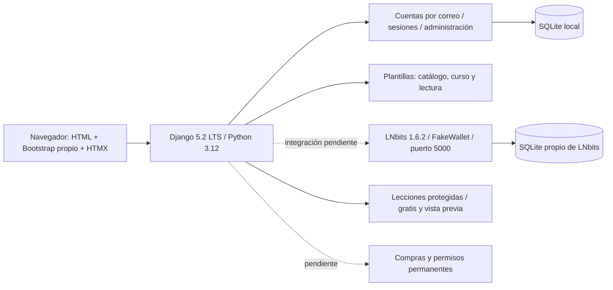

# BTC.EDU — base técnica y visual

Estado al **2 de octubre de 2026** (Guatemala): portada y catálogo conectados al contenido publicado, búsqueda y filtros, detalle de curso y pantalla de lectura con temario y navegación. La página para creadores, entrada por correo y espacio privado siguen disponibles. Las lecciones de pago están protegidas; precios y compras siguen pendientes. No se han creado registros de cursos, capítulos, videos, materiales, ofertas ni precios en la base del usuario. Los ejemplos de la imagen aprobada y de strategy/02 no se cargan. Ver [recorrido e investigación aplicada](docs/recorrido-aprendizaje-2026-10-02.md) y [base de contenido](docs/contenido.md).

Todo el código, configuración, herramientas y documentación técnica vive en `/src`. Business y requisitos están en `/strategy`; los originales del assignment permanecen en `/docs`, sin modificaciones.

## Arranque local en Windows

Para desarrollar e inicializar todo desde la raíz, usa **Windows PowerShell 5.1 o PowerShell 7**:

```powershell
./dev.ps1
```

Prepara o actualiza ambos entornos, aplica migraciones pendientes y arranca Django con recarga automática y LNbits con FakeWallet. Conserva las bases de datos y los `.env` existentes. El primer arranque requiere internet y Git para descargar LNbits. Ctrl+C detiene los servicios iniciados por el script. Los puertos 8000 y 5000 deben estar libres; los registros de LNbits quedan en `src/.local/lnbits-dev.*.log`. La integración de facturas con Django sigue pendiente.

Para preparar y arrancar únicamente la plataforma con recarga automática:

```powershell
./dev-platform.ps1
```

Si Windows bloquea los scripts, puedes invocarlos con `powershell -ExecutionPolicy Bypass -File .\dev.ps1` o `powershell -ExecutionPolicy Bypass -File .\dev-platform.ps1`. El permiso se aplica solo a ese proceso.

También puedes preparar y arrancar cada componente por separado:

Desde la raíz del repositorio, en PowerShell:

```powershell
./src/scripts/setup-platform.ps1
./src/scripts/start-platform.ps1
```

Abrir **http://127.0.0.1:8000/**. Detener con Ctrl+C. El primer setup requiere internet, descarga uv oficial si falta, instala las versiones fijadas en `uv.lock`, genera una clave aleatoria privada en `src/.env` y aplica migraciones. No reemplaza un `.env` existente. El servidor escucha únicamente en la máquina local.

SQLite es el motor elegido por el usuario para esta etapa. La base se conserva en `src/.local/platform.sqlite3`; no requiere servidor ni credenciales de base de datos. Setup reutiliza la base existente y aplica migraciones pendientes. Ver [configuración y límites](docs/base-tecnica.md).

Para crear una cuenta de administración, desde `src`:

```powershell
./.venv/Scripts/python.exe manage.py createsuperuser
```

Introducir la contraseña en el terminal. No hay cuentas de demo incluidas ni registro público. El acceso por correo funciona con cuentas creadas por este comando o la administración.

## LNbits separado

```powershell
./src/scripts/setup-lnbits.ps1
./src/scripts/start-lnbits.ps1
```

LNbits: http://127.0.0.1:5000/, **FakeWallet, sin fondos reales**. Tiene su propio entorno `.local/lnbits/.venv`, configuración y SQLite. La plataforma usa `.venv`. Compartir uv y su caché no mezcla dependencias. Django todavía no crea ni consulta facturas; la configuración de esa integración se añadirá cuando se implemente.

Con LNbits activo, su prueba independiente desde la raíz:

```powershell
./src/.local/lnbits/.venv/Scripts/python.exe src/scripts/smoke-lnbits.py
```

La prueba crea wallets y pagos ficticios, no contenido. Preservar `.local/` y `.env`; contienen datos y credenciales privadas. Ver [LNbits local](docs/lnbits-local.md).

## Arquitectura actual y prevista



Las líneas discontinuas son funciones futuras. Django mantendrá autorización y reglas comerciales en el servidor; LNbits no sustituye catálogo, compras ni cuentas. Sus claves nunca llegan al navegador.

## Estructura

- `accounts/`: usuario por correo, unicidad sin distinguir mayúsculas, administración y migración inicial.
- `core/`: páginas, catálogo vacío, health y pruebas.
- `content/`: cursos, capítulos, lecciones de texto, fichas de videos/materiales, administración y regla de acceso.
- `platform_config/`: configuración, rutas y WSGI.
- `templates/`, `static/`: portada, catálogo, curso, lectura y estados vacíos; NType82, Ndot77 y Space Mono locales e ilustración industrial independiente; Bootstrap 5.3.8 y HTMX 2.0.8 locales.
- `design/`: concepto aprobado conservado.
- `scripts/`, `config/`: preparación, arranque, comprobación y ejemplos sin secretos.
- `docs/`: arquitectura, componentes, pruebas y límites.
- `.local/`, `.venv/`, `.env`: excluidos de Git.

## Verificación y alcance

```powershell
./src/scripts/check-platform.ps1
```

SQLite restaurado y dependencias MySQL retiradas. Veinticuatro pruebas Django pasan, migraciones consistentes y revisión estática sin errores. [Recorrido de aprendizaje](docs/recorrido-aprendizaje-2026-10-02.md), [resultados de la base visual](docs/verificacion-2026-10-01.md), [pruebas de contenido](docs/contenido.md), [componentes](docs/componentes-visuales.md).

Esta base **no completa el MVP del assignment**. Faltan contenidos, compras, permisos, estados de factura integrados, actividad, creadores, progreso, evaluaciones, certificados, comunidad y membresías. Ver [diseño completo](docs/diseno-plataforma.md). No hay prueba de concurrencia de compras: comercio no está implementado. SQLite no demuestra bloqueos de filas ni capacidad de compras concurrentes; esa limitación se mantiene explícita.

No se publicó, desplegó ni hizo push. Historial diario GitHub, Google Doc de Business, entrevistas y validación externa siguen pendientes. Las fechas oficiales 3/8 de noviembre y el equipo dos/cuatro integrantes continúan sin aclarar.
