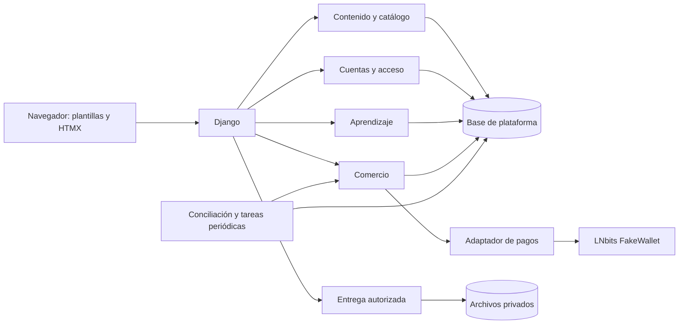

# Arquitectura técnica prevista de BTC.EDU

Actualizada el **2 de octubre de 2026**, Guatemala. Traduce la [definición de producto y experiencia](../../strategy/10-arquitectura-y-experiencia-btc-edu.md). Es un diseño para implementar por fases. Estado real: cuentas por correo, administración básica, cursos/capítulos/lecciones de texto, fichas Video/Material, catálogo, detalle y lectura protegida. LNbits funciona aparte. No existen aún compras, archivos entregables, progreso ni módulos ampliados.

## Plataforma y fronteras

Conservar Django 5.2 LTS, Python 3.12, plantillas, HTMX y Bootstrap con estilos propios. Una aplicación Django modular controla cuentas, publicación, comercio y aprendizaje. LNbits es un proveedor separado; no organiza contenido ni autoriza alumnos. HTML generado en servidor es la interfaz principal; JavaScript acotado atiende reproductor, cargas, guardado y componentes interactivos.

SQLite sigue siendo la decisión para desarrollo local. No se cambia el motor en esta etapa. Antes de mayor concurrencia pública evaluar una base de servidor, con propuesta y migración independientes. No confundir esa evaluación futura con configuración implementada.

| Módulo | Propiedad de datos y responsabilidad | Momento |
|---|---|---|
| `accounts` | Cuenta, perfil, solicitud/aprobación de creador, grupos/permisos y recuperación | Ampliar existente |
| `core` | Portada, estructura común y composición del espacio personal | Ampliar existente |
| `content` | Temas, cursos/tutoriales, versiones, capítulos, lecciones, recursos, referencias y catálogo | Ampliar existente |
| `media` | Archivos, validación, almacenamiento, subtítulos, muestras y entrega | Primera academia |
| `commerce` | Ofertas/versiones, facturas, evidencia, compras, permisos y conciliación | Primera academia |
| `learning` | Inscripción, posición, completadas, biblioteca y marcadores | Primera academia |
| `activity` | Eventos, incidencias, tareas persistentes y métricas simuladas | Primera academia |
| `creator` | Panel y revisión usando modelos de contenido | Operación |
| `assessments` | Preguntas versionadas, intentos, respuestas y corrección | Aprendizaje ampliado |
| `certificates` | Requisitos, emisión única, PDF y verificación limitada | Aprendizaje ampliado |
| `community` | Preguntas, espacios, participación y moderación | Aprendizaje/relación |
| `memberships` | Plan/versiones y periodos; usa facturas de comercio | Relación |

Las fronteras no obligan a crear todas las carpetas vacías ahora. `creator` no duplica cursos. Notificaciones pueden comenzar en `activity`. Eventos educativos futuros tienen su modelo al definir operación; no son eventos de actividad del assignment.

Vistas validan sesión, método y formulario; consultas construyen catálogo/biblioteca; servicios ejecutan publicación, compra y progreso. `content.access` conserva una fachada única de autorización usada por HTML, JSON y archivos. Integrar proveedores de compra/membresía con dependencias explícitas, evitando importaciones circulares y reglas duplicadas en plantillas.

## Modelo conceptual

Nombres orientativos que se concretarán en migraciones por fase.

| Entidad | Datos y relaciones |
|---|---|
| `Topic`, `Tag` | Nombre, slug único, padre opcional, orden editorial y visibilidad |
| `Course` | Identidad estable, creador, tipo curso/tutorial y versión pública vigente |
| `CourseVersion` | Número único por curso; título/resumen/objetivos/requisitos, tema, nivel, portada, idioma, estado, fechas y reglas de finalización |
| `Chapter`, `Lesson` | Pertenecen a versión, orden único por padre; lección enlaza contenidos/evaluación y define si es requerida |
| `Resource`, `ResourceVersion` | Identidad reutilizable y revisión de texto/video/material; cuerpo/archivo, acceso, duración, procedencia, estado editorial y disponibilidad |
| `LessonResource` | Lección, versión de recurso, posición y función principal/adjunto; relación pedagógica sin permiso implícito |
| `ExternalReference` | Tema/tipo, título, origen/autor, URL HTTP/HTTPS, idioma, fecha de revisión y asociaciones; no se vende |
| `MediaAsset` | Nombre interno, tamaño/tipo, ubicación, propietario, validación y relación de subtítulo/muestra |
| `Offer`, `OfferVersion`, `OfferItem` | Identidad comercial, importe entero positivo en sats, composición publicada y versiones de recursos incluidas |
| `Invoice` | UUID, comprador, oferta, importe/lista congelados, vencimiento y estado |
| `ProviderAttempt`, `PaymentEvidence` | Solicitud externa, referencia/hash únicos, resultado y tiempos observados, incluso ante incidencia |
| `Purchase`, `Entitlement`, `EntitlementSource` | Compra única por factura, derecho único alumno/revisión de recurso y fuentes de ese derecho |
| `Enrollment`, `LessonProgress`, `SavedResource` | Alumno/versión, última lección, posición, completadas y marcador independiente |
| `ActivityEvent`, `PendingTask` | Tipo, actor/objeto, referencias para deduplicar y tareas reintentables sin secretos |

La lección de texto actual migra a un recurso de texto conservando cuerpo/acceso y asociación. Video/Material migran a recurso propio del tipo correspondiente; se agregan archivos mediante carga validada, sin inventar ofertas o archivos. Tutorial es `Course.kind=tutorial`, compartiendo motor y con vistas propias. No se convierte un curso publicado en tutorial silenciosamente.

Un permiso apunta a una revisión inmutable de recurso. Reutilizarla en otra lección no exige comprarla de nuevo. Cambiar comercialmente el contenido crea revisión/condiciones explícitas. Una oferta de curso referencia su versión y lista recursos, no concede un permiso genérico que se expande según el temario actual.

Al publicar se congela composición, revisiones y requisitos. Correcciones de presentación sin modificar contenidos adquiridos/exigencias pueden registrarse como edición; cambios comerciales o educativos crean versión. Inscripciones conservan la anterior. Migrar avance requiere correspondencia explícita y elección del alumno. La nueva versión no invalida credenciales.

Proteger con `PROTECT` o política equivalente versiones referenciadas por compras, progreso, intentos y certificados. La cascada actual Course → Chapter → Lesson no puede borrar historial comprado. Conservar IDs/rutas actuales y agregar rutas para versiones históricas. Si se añaden slugs, redirigir cambios sin romper enlaces.

## Publicación y autorización

Estados: Draft, InReview, ChangesRequested, Published, Archived. Separar disponibilidad excepcional de recursos bloqueados, con motivo/auditoría. Versión archivada no equivale a borrador.

Orden de entrega:

1. Comprobar existencia, versión y disponibilidad. Borrador/revisión → 404 para terceros; propietario activo o permiso explícito de inspección permite vista previa.
2. Recurso bloqueado por disponibilidad → denegar y explicar donde corresponda; compra/rol no omiten ese control.
3. Publicado gratuito → lectura anónima. Archivado → contenidos gratuitos disponibles para inscritos de esa versión; adquiridos disponibles para titulares, sin volver a listarlos.
4. De pago → permiso permanente o periodo vigente que incluya esa revisión. Devolver motivo/vigencia; presentar primero la propiedad permanente.
5. Sin permiso → bloqueo y oferta, sin cuerpo, archivo ni subtítulo privado. Inscripción, marcador y progreso no autorizan pago.

Metadatos públicos y entrega son operaciones distintas. HTML, JSON y fragmentos bloqueados no incluyen contenido protegido. Respuestas personalizadas no van a caché compartida. Página archivada exige inscripción/compra de esa versión. Staff no equivale a comprador; inspección administrativa tiene permiso y registro propio.

Compra parcial compara propiedad permanente. Acceso temporal no bloquea comprar. Paquete totalmente adquirido → Abrir; parcialmente → ofertas individuales faltantes; sin propiedad → paquete. Validar alternativas individuales antes de publicar, sin cálculo de descuento personalizado.

## Comercio y conciliación

Mantener Pending, Paid, Expired y Failed del documento 03. Separar estado comercial de evidencia del proveedor y conciliación. Precio/composición quedan congelados y vigencia es 15 minutos.

1. Validar cuenta/oferta, expirar pendientes y reservar factura local atómicamente; una pendiente por comprador/oferta lógica incluso si cambia precio vigente.
2. Crear/recuperar intento externo fuera de transacción de escritura. Timeout es resultado desconocido; seguir la misma factura, sin emitir otra a ciegas.
3. Consultar pago desde servidor usando referencia almacenada. Si existe notificación, autenticarla y usarla para consultar; no confiar en una afirmación del navegador.
4. Transacción corta: revalidar factura/tiempo/propiedad, conservar evidencia, crear compra/derechos/fuentes/evento una sola vez. Repetición devuelve lo existente. No esperar red bajo bloqueo.
5. Registrar tareas de notificación en la misma transacción y procesar después. Fallo de aviso no revierte compra ni pierde tarea.

Restricciones únicas: pendiente por comprador/oferta, referencia externa, compra por factura, derecho por alumno/revisión, fuente por derecho/compra, periodo por factura y evento de pago por factura. Transiciones condicionales y restricciones, no solo `if` antes de `save`.

SQLite no ofrece bloqueo de filas con `select_for_update()`. Estrategia local prevista: transacciones cortas de escritura serializadas con modo `IMMEDIATE`, relectura dentro del bloqueo, restricciones y reintentos acotados. Debe implementarse y probarse; hoy se usa modo por defecto. [Django documenta los modos y la limitación](https://docs.djangoproject.com/en/5.2/ref/databases/#sqlite-notes).

Probar con archivo SQLite y conexiones/procesos distintos: misma oferta, ofertas solapadas, vencer/confirmar, reinicio y bloqueos. `atomic()` por sí solo no demuestra concurrencia. No incluir red/correo en transacciones ni presentar un error de bloqueo como éxito.

Evidencia tardía o solapada se preserva como incidencia administrativa. En simulación: vencida conserva Expired y compra inelegible termina Failed, sin permisos nuevos, aunque el proveedor registre pago. No borrar ese hecho. Fondos reales requerirían otra política para resolver cobros confirmados.

Comando de gestión periódico: conciliar pendientes, vencer y procesar tareas tras reinicio; consulta también al volver a factura. Supervisor independiente del navegador. Al implementar, comprobar capacidades de búsqueda/reintento de LNbits instalado; no asumir idempotencia externa. Solicitud desconocida sin recuperación segura requiere incidencia antes de otra emisión.

Usar tareas persistidas para avisos fiables. `on_commit` ayuda a iniciar acciones después del commit, pero no es una cola durable: [Django, acciones después de commit](https://docs.djangoproject.com/en/5.2/topics/db/transactions/#performing-actions-after-commit).

## Archivos y reproducción

Portadas/muestras públicas separadas de archivos privados. Validar extensión, MIME/contenido, tamaño, propietario y estado; nombres internos. Sin HTML arbitrario ni ejecutables como material normal. Enlaces externos validan esquema y no necesitan descarga desde el servidor.

Contenido privado fuera de `static` y sin MEDIA público. Endpoint consulta la autorización antes de texto, video, VTT y descarga. MP4 inicial con Range/206/416 correctos, controles del navegador, subtítulos y transcripción cuando exista. Muestra es otro archivo público, no el video entero oculto. Descargas con nombre/cabeceras seguros.

Interfaz de almacenamiento permite reemplazar disco por almacenamiento privado y transferencia autorizada en despliegue. Proveedor/CDN no elegido. Proxy puede transferir después de autorización sin abrir el directorio privado. Archivo ausente muestra incidencia útil, no ruta interna. Cargas incompletas no se publican; reemplazo conserva revisión comprada. Primera fase sin promesa de transcodificación multicalidad ni protección contra copia autorizada.

## Aprendizaje y ampliaciones

Inscripción única alumno/versión. Compra de curso puede inscribir; compra de video/material añade recurso a biblioteca y ofrece inscripción voluntaria al curso relacionado. Inscripción no compra extras.

Guardar progreso exige sesión, propiedad, lección de esa inscripción y acceso. Posición acotada a duración conocida; revisión de guardado evita que petición antigua sobrescriba la nueva. Permitir volver deliberadamente hacia atrás. Operaciones repetidas son seguras; completadas persisten salvo desmarcado explícito permitido. Denominador: lecciones requeridas de la versión, sin extras opcionales. Progreso permanece al vencer membresía.

Evaluaciones ligadas a preguntas versionadas, límites de intentos y corrección en servidor, sin soluciones antes de cerrar. Certificado único por alumno/versión, requisitos comprobados, identificador no predecible y datos mínimos compartidos. Comprar no certifica.

Membresía: plan versionado con recursos/espacios, periodos de 30 días, renovación desde el mayor entre confirmación y fin vigente y unicidad por factura. Cancelar conserva periodo; vencimiento se comprueba por fecha en cada acceso. No insertar permisos permanentes por membresía. Progreso y certificados permanecen.

Preguntas/comunidad: permiso propio por espacio; video individual no concede comunidad de curso automáticamente. Reportes/moderación con motivo, actor y fecha, paginación y límites. Sin chat privado ni adjuntos en comentarios inicialmente.

## Contratos previstos y presentación

Preservar rutas actuales; estas son propuestas por fase, no endpoints existentes:

| Acción | Contrato orientativo |
|---|---|
| Catálogo/selector | GET `/cursos/`, `/cursos/selector/`; contexto en URL |
| Tutoriales/recursos | GET `/tutoriales/`, `/recursos/`, fichas por ID estable |
| Cuenta | GET formulario; POST registro, solicitud y cambio de contraseña |
| Inscripción/marcador | POST alta/baja autorizada; sin mutaciones GET |
| Biblioteca | GET `/mi-aprendizaje/` y versión inscrita |
| Factura | POST `/facturas/`, GET `/facturas/<uuid>/` propio |
| Archivo | GET revisión autorizada, Range en video |
| Progreso | POST `/inscripciones/<id>/progreso/` con revisión/respuesta de guardado |
| Creación | POST edición/revisión/publicación con propiedad y versión |
| Evaluación/certificado | POST inicio/cierre/emisión, GET verificación pública limitada |
| Membresía | POST renovar/cancelar desde cuenta propia |

CSRF en todas las mutaciones de navegador, actor derivado de sesión y métodos/campos validados. Simulación de pagos/fallos solo en modo de prueba con permisos explícitos. Retorno de registro/login restringido a destino local. Fragmento y página completa comparten consulta/autorización.

Catálogo filtra/pagina en base, usa metadatos y agregados sin cuerpos o todos los temarios. Selector usa los mismos resúmenes/ofertas. Ficha carga su temario con consultas acotadas. Biblioteca consulta inscripciones/permisos; no historial de navegación. Plantillas de estructura pública, academia y estudio con componentes compartidos. Filtros/navegación funcionan sin HTMX; reproductor/guardado tienen estados de error honestos.

## Operación, migración y verificación

Registro/recuperación con límites de abuso, mensajes no enumerables, tokens vencibles y correo probado. Propiedad validada en cada operación de creador. No mostrar correos de alumnos en métricas públicas ni guardar secretos en eventos/logs.

Producción: servidor WSGI/ASGI apropiado, HTTPS/proxy probado, DEBUG desactivado, hosts/cookies, estáticos, correo, almacenamiento, supervisor de conciliación, respaldos consistentes base/media y restauración. Observar errores, facturas antiguas, discrepancias y tareas/archivos fallidos. `runserver` no es el servicio final.

Implementar versión/composición antes de compras. Respaldar antes de migraciones, preservar IDs/datos y crear versión inicial de registros existentes, sin añadir cursos de ejemplo. Migraciones incrementales, sin reinicializar SQLite ni LNbits.

Pruebas de cierre por fase:

- Catálogo/selector/tutoriales/recursos: filtros, paginación, oferta/resumen consistente, retorno y vacíos.
- Acceso: anónimo, comprado, inscripción, propietario, otro creador, staff sin inspección, archivado y bloqueado.
- Entrega: texto, Range, VTT, descarga y muestra sin fuga privada.
- Comercio: duplicados, snapshot, parcial, solapamiento, proveedor desconocido, vencimiento/reinicio/conciliación en conexiones distintas.
- Aprendizaje: dispositivos, guardados desordenados, sesión perdida, versión nueva y extras.
- Creación: aislamiento, faltantes, carga fallida, revisión y protección de versiones adquiridas.
- Ampliaciones: AC-21…35 del documento 08.
- Interfaz: móvil, teclado, lector de pantalla, foco, contraste, subtítulos y rendimiento; [objetivo WCAG 2.2 AA](https://www.w3.org/WAI/WCAG22/quickref/).
- Operación: restauración, correo, LNbits caído, supervisor y archivos ausentes.

Las 24 pruebas existentes cubren la base anterior, no estos módulos futuros. Datos temporales para pruebas/diseño; no poblar la base del usuario con el catálogo ficticio sin autorización. README y registros de verificación describen implementación real por separado.
