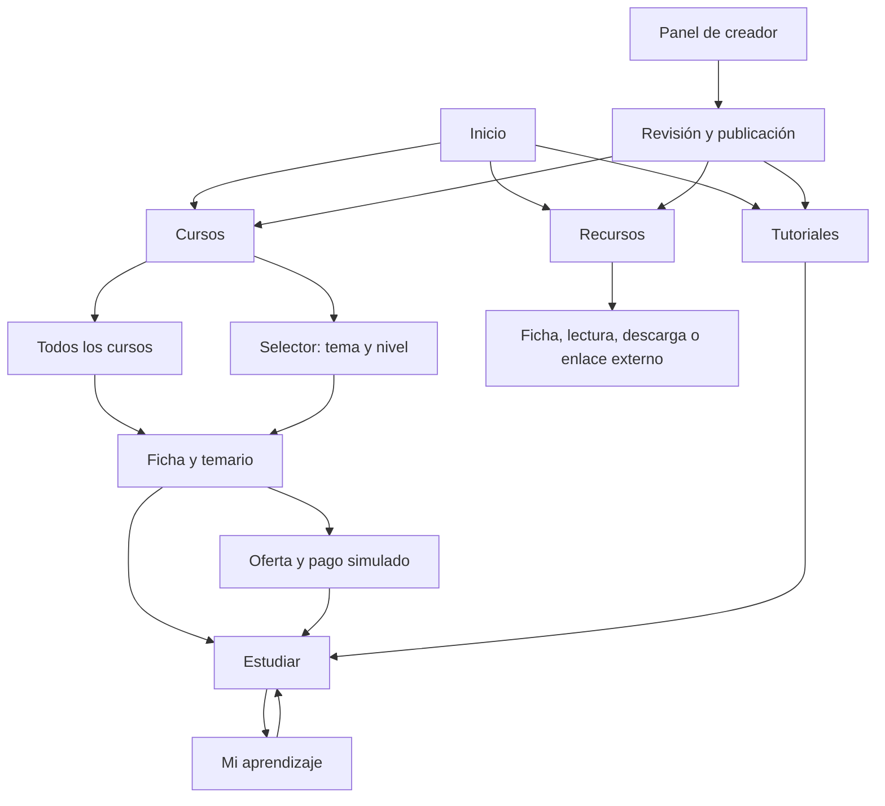

# BTC.EDU — arquitectura de producto y experiencia

Definición de trabajo del **2 de octubre de 2026**, Guatemala. Orienta las siguientes implementaciones; no acredita que las funciones descritas ya existan. El usuario confirmó cursos, tutoriales y recursos en la primera versión, y eventos después. Las reglas anteriores de compras simuladas, acceso permanente, revisión por administrador y membresías manuales se conservan. Las decisiones nuevas de organización y comportamiento son la base propuesta para desarrollar y validar, no resultados de entrevistas.

**Estado de implementación al 4 de octubre:** cuentas independientes, aprobación/perfil, estudio/editor/archivos, revisión, versiones, ofertas y compras simuladas, biblioteca, inscripción y progreso básico ya funcionan. 129 pruebas pasan. [Entrega y límites verificados](../src/docs/comercio-y-aprendizaje-2026-10-04.md). Evaluaciones, certificados, preguntas, comunidad, membresías y métricas completas permanecen pendientes; las secciones siguientes definen el horizonte del producto.

## 1. Producto y referencia

BTC.EDU será una academia donde una persona puede encontrar contenido adecuado, entender qué aprenderá y qué incluye el acceso, estudiar a su ritmo y retomar su avance. Los micropagos permiten adquirir capítulos, videos o materiales sin obligar a comprar un curso entero. Coexisten cursos gratuitos, muestras gratuitas, compras permanentes y, en una fase posterior, membresías temporales.

Las cuatro capturas suministradas muestran: catálogo por temas con tarjetas y filtros; selector tema → nivel → curso con resumen; tutoriales por categoría con búsqueda; biblioteca de recursos por tipo. También muestran navegación lateral persistente y pestañas propias de cada sección. Son evidencia de esas pantallas de escritorio. No permiten afirmar cómo funcionan progreso, pagos, administración, certificados ni móvil en Plan B Academy.

Tomamos de la referencia la organización, jerarquía y continuidad de navegación. Conservamos la dirección visual aprobada de BTC.EDU: blanco cálido, negro, naranja discreto, tipografía legible e identidad industrial. No se copian marcas ni ilustraciones de la referencia.

El nombre BTC.EDU no cambia automáticamente el público o los temas ya propuestos en el documento 01. La temática editorial definitiva debe validarse; Bitcoin, tecnología o programación son datos de catálogo, no categorías codificadas en la aplicación. Se inicia en español. La traducción completa es posterior y requiere traducir también los contenidos, no solo añadir un selector de idioma.

## 2. Alcance y orden

| Entrega | Funciones | Condición de cierre |
|---|---|---|
| Primera academia funcional | Cursos, selector, tutoriales, recursos, registro/recuperación, texto/video/archivos, ofertas y compra simulada, biblioteca, inscripción y progreso básico, administración | Encontrar → abrir o comprar → estudiar → retomar en otra sesión; sin pérdida de permisos |
| Operación por creadores | Perfil, solicitud/aprobación, editor, cargas, revisión, versiones y métricas propias | Un creador prepara contenido y un administrador lo publica sin alterar compras previas |
| Aprendizaje ampliado | Evaluaciones, certificados, preguntas y notificaciones | Intentos y requisitos verificables; respuestas contextualizadas |
| Relación continua | Comunidad, moderación y membresías de 30 días con renovación manual | Acceso temporal, compras y progreso conviven correctamente |
| Ampliaciones posteriores | Eventos, reseñas, rutas editoriales más avanzadas e idiomas | Datos, responsable operativo y validación para cada función |

Progreso, evaluaciones, certificados, comunidad y membresías siguen dentro del alcance completo del documento 08; escalonarlos no los elimina. Eventos y reseñas amplían el horizonte, sin convertirse en requisito de la primera entrega. No se promete una fecha para toda la lista antes de revisar capacidad. Los eventos de actividad del assignment son registros del sistema y siguen en la primera entrega; son distintos del futuro calendario de eventos educativos.

No se incluyen fondos reales, liquidaciones a creadores, descuentos personalizados, chat privado, vigilancia de exámenes ni recomendaciones mediante IA en esta etapa.

## 3. Navegación y superficies

La portada pública explica la propuesta y conduce a aprender. El interior de la academia usa una estructura común: encabezado compacto, navegación lateral en escritorio, área principal y navegación local de la sección. La lectura prioriza el contenido y permite plegar la navegación global para dejar espacio al temario.

| Área | Navegación local | Visibilidad |
|---|---|---|
| Cursos | Todos / Selector | Pública |
| Tutoriales | Todos / categorías disponibles | Pública |
| Recursos | Todos / tipos disponibles | Pública |
| Mi aprendizaje | Continuar / cursos / tutoriales / recursos guardados | Cuenta |
| Compras y acceso | Compras / facturas / membresías cuando existan | Cuenta |
| Cuenta | Perfil / contraseña / preferencias de privacidad | Cuenta |
| Crear | Contenidos / revisión / preguntas / métricas según fase | Creador aprobado |
| Administración | Publicación / cuentas / facturas / moderación | Personal autorizado |

Certificados se agregan a Mi aprendizaje cuando la función esté lista. Comunidad y eventos aparecen al disponer de la función y contenido operable. La navegación no ofrece enlaces que solo conducen a promesas.

En móvil: menú global plegable con foco controlado, encabezado breve, tarjetas en una o dos columnas según espacio, filtros desplegables y temario accesible desde la lección. Las pestañas pueden desplazarse horizontalmente; la página no debe exigir desplazamiento horizontal. El selector pasa de tres columnas a pasos tema → nivel/curso → resumen, conservando selección y regreso.

## 4. Qué es cada contenido

| Concepto | Uso y relación |
|---|---|
| Tema | Clasificación principal configurable; puede tener subtemas. Un curso tiene un tema principal y etiquetas complementarias |
| Nivel | Principiante, intermedio o avanzado; es un requisito editorial, no una medida de progreso del alumno |
| Curso | Recorrido amplio con objetivos, requisitos, capítulos y lecciones; puede combinar gratis y pago |
| Tutorial | Guía breve orientada a una tarea concreta; reutiliza capítulos/lecciones, lectura y progreso; tiene catálogo propio |
| Capítulo | Agrupación ordenada de lecciones; puede tener una oferta que enumera lo incluido |
| Lección | Unidad de aprendizaje con texto, video, materiales relacionados y posteriormente evaluación |
| Recurso propio | Video independiente, guía, ejercicio o archivo alojado; puede estar vinculado a varios contenidos sin duplicar el archivo |
| Referencia externa | Libro, proyecto, podcast, canal, artículo u otro enlace curado; no es un archivo vendido ni protegido por BTC.EDU |
| Archivo | Video, documento, imagen, subtítulo o muestra; su ubicación técnica no determina el precio ni el permiso |
| Oferta | Condiciones de compra e inventario exacto de recursos incluidos; no es el temario |
| Inscripción | Relación del alumno con una versión de curso o tutorial para conservar aprendizaje |
| Permiso | Derecho de abrir un recurso por compra permanente o acceso temporal |

El tutorial se implementará como variante del recorrido educativo existente, no como un segundo motor de aprendizaje. Un video vendido individualmente y mostrado en una lección apunta al mismo recurso protegido: comprarlo una vez concede acceso a ese mismo video donde aparezca.

Los enlaces externos indican origen y que se sale de BTC.EDU; no se bloquean ni se venden como si fueran archivos propios. Una descarga propia asociada a un curso indica si es gratis, incluida en la compra o extra. Un recurso guardado no equivale a un recurso comprado.

## 5. Descubrir y elegir

### Catálogo de cursos

Tarjeta: portada original o autorizada, título, resumen breve, creador, nivel, duración estimada y acceso/precio. El distintivo “Empieza aquí” es una selección editorial explícita. No se inventan duraciones, estrellas, alumnos o resultados. La duración puede sumar minutos de video y lectura estimada; se etiqueta como estimación, diferenciando tiempo de video.

Vista inicial: grupos por tema con una selección editorial y enlace “Ver todos”. Cada grupo usa una retícula o fila navegable con controles accesibles, sin reproducción automática. La vista de un tema o búsqueda usa resultados paginados; en la primera implementación preferimos retícula para que el descubrimiento no dependa de un carrusel.

Filtros combinables: tema, nivel, formato de lecciones, acceso y búsqueda. Orden inicial editorial en la portada del catálogo; resultados por relevancia sencilla o título y opción de recientes. Los filtros y la página quedan en la URL, se pueden compartir, y volver desde una ficha conserva el contexto. “Limpiar filtros” y número de coincidencias visibles.

Acceso describe tres situaciones: “Todo gratis”, “Gratis con extras” y “De pago · muestra gratis” si existe muestra. Una etiqueta “Desde X sats de prueba” solo aparece cuando existe una oferta activa que la justifica; junto a ella se aclara si es precio del curso, capítulo o extra. El filtro gratis no debe hacer pasar un curso mixto por totalmente gratuito.

### Selector de cursos

Otra presentación del mismo catálogo: tema, cursos agrupados por nivel y resumen del curso seleccionado. Resumen: portada, título, objetivo breve, creador, nivel, duración, acceso/precio y enlace a la ficha. No duplica ofertas ni contenido ni requiere un recomendador automático.

Estado seleccionado representado en URL. Al cambiar tema se limpia una selección incompatible. Si no hay cursos en un nivel no se muestra una opción vacía como recomendación. Carga y errores conservan contexto. Teclado y móvil permiten realizar la selección completa.

### Tutoriales

Categorías por tarea o tema, búsqueda y filas con icono/portada, título, resumen, nivel, duración y acceso. La ficha explica el resultado práctico, requisitos, herramientas, fecha de revisión y pasos. Puede ser una sola lección o varias. Un tutorial sin cuenta se abre cuando es gratuito; con cuenta puede guardarse y retomarse.

### Biblioteca de recursos

Índice por tipo, búsqueda y filtros por tema, formato/idioma cuando haya datos. Tipos configurables; no se añaden once categorías vacías solo por reproducir la captura. Ficha con autor/origen, descripción, idioma, tipo, fecha de revisión, relación con cursos y acción adecuada: leer, reproducir, descargar, adquirir o visitar fuente.

Los recursos externos requieren revisión editorial de enlaces y procedencia. Los propios requieren archivo disponible y permiso correcto. Una ficha informativa sin archivo no presenta un botón de descarga funcional.

## 6. Curso, aprendizaje y continuidad

La ficha debe responder: qué aprenderé, para quién es, qué necesito, quién enseña, cuánto tiempo requiere, qué contiene, cuánto cuesta y qué obtengo. Incluye portada/muestra, objetivos, requisitos, temario plegable, formatos y duración por lección, extras e información de certificado si aplica.

La acción principal depende de la situación: “Empezar gratis”, “Inscribirme gratis”, “Comprar curso”, “Continuar” o “Abrir contenido comprado”. Nunca depende solo de la etiqueta visual. En cursos mixtos las acciones gratuitas y las ofertas opcionales están separadas.

La pantalla de estudio contiene título y contexto, lector/reproductor, temario con lección actual, navegación anterior/siguiente, materiales y progreso. Posteriormente incorpora evaluación y preguntas. Una lección bloqueada muestra el motivo y la oferta aplicable sin recibir el cuerpo, URL de archivo ni subtítulos protegidos. No se avanza automáticamente hacia una compra.

Video: controles de reproducción, teclado, velocidad, pantalla completa, subtítulos y transcripción cuando exista. Guarda posición con frecuencia limitada y al pausar/salir; muestra confirmación de guardado o aviso de error. Un salto al final no demuestra video observado. En la primera versión el usuario puede marcar lecciones como completadas manualmente; requisitos de visionado o evaluación se añaden cuando se implementen sus comprobaciones.

Progreso por alumno y versión: última lección, posición y completadas. “Continuar” lleva a la última lección accesible; si está temporalmente bloqueada, explica cómo recuperar acceso y permite elegir una lección disponible. No borra el progreso. El porcentaje usa las lecciones requeridas de esa versión; extras opcionales no penalizan la finalización. Completar texto no equivale a demostrar dominio.

Mi aprendizaje muestra primero Continuar, después inscritos y completados. Permite filtrar cursos/tutoriales, ver porcentaje y estado de acceso, recursos guardados y certificados cuando existan. Compras y facturas están separadas del progreso. Compras individuales aparecen como recursos y dentro de su curso relacionado, sin afirmar que se posee el curso completo.

El visitante puede consumir contenido gratuito sin cuenta. Se ofrece registro para guardar avance. Para comprar, evaluar o participar se exige sesión conservando el destino. No se guarda progreso personal de invitados como si perteneciera a una cuenta.

## 7. Reglas de compra y acceso

La oferta identifica versión, importe entero en sats de prueba, recursos incluidos y extras excluidos. Compra de curso o capítulo concede los recursos enumerados, no todos los objetos relacionados. La inscripción, un rol de creador, un marcador y una tarjeta de biblioteca no conceden pago.

Se mantiene la regla vigente de compra parcial: si ya se posee parte permanente del paquete, no se vende otra vez el paquete completo; se muestran las ofertas individuales faltantes y sus precios. Cada componente pagado incluido debe tener una alternativa comprable por separado antes de publicar el paquete. No se calcula un descuento nuevo a partir del precio del paquete. Esta regla añade fricción y deberá probarse; un futuro precio por diferencia requiere una decisión comercial propia.

Una membresía vigente no equivale a propiedad permanente: permite estudiar y muestra “Incluido hasta…”, pero deja comprar acceso permanente si el usuario elige hacerlo con explicación visible. Renovación de 30 días manual; cancelar significa dejar de ofrecer/recordar renovación, no retirar el periodo pagado. No hay mandato de cobro automático.

Factura: propia de una cuenta, precio y composición congelados, vigencia de 15 minutos. Se reutiliza la pendiente de la misma oferta; un error de conexión no se interpreta como impago. Pago confirmado válido → compra y permisos persistentes. Pendiente, vencida o fallida → sin permisos nuevos. Confirmaciones repetidas no duplican acceso ni periodos.

La interfaz de prueba identifica claramente la simulación y permite comprobar estados. No muestra QR ni instrucciones para enviar fondos reales. Las claves LNbits permanecen en el servidor. Evidencia de pago recibida después de vencimiento o con solapamiento comercial se conserva como incidencia de conciliación; no se hace pasar por una compra completada ni se descarta la evidencia. El detalle técnico está en src/docs/diseno-plataforma.md.

Se separan publicación y disponibilidad: borradores invisibles a terceros; retirado del catálogo conserva acceso de compradores a su versión; bloqueo excepcional por problema de contenido se registra y explica. Archivar una oferta no elimina compras. Los requisitos de certificados, recursos comprados y planes tienen versión; actualizar el catálogo no los reemplaza silenciosamente.

## 8. Cuentas, creación y administración

Registro, login, cierre de sesión y recuperación con destino conservado dentro de cada espacio. Perfil con nombre visible; correo no publicado en tarjetas. Mensajes de recuperación no revelan si un correo existe. Token de recuperación con vencimiento; la entrega por correo debe probarse antes de abrir el sitio al público. Decisión del 3 de octubre: creador y estudiante tienen cuentas independientes, accesos y perfiles separados. Una persona puede tener ambos usando incluso el mismo correo; contraseña, permisos y datos pertenecen a la identidad de cada espacio. La administración tiene acceso propio. El estudio usa navegación de creación, separada de la navegación de aprendizaje.

Creador aprobado: perfil, cursos/tutoriales/recursos propios, editor ordenado, archivos/subtítulos/muestras, metadatos, ofertas, vista como alumno, lista de faltantes y envío a revisión. Los formularios conservan cambios ante error y avisan antes de salir con cambios sin guardar. Cargas muestran progreso, validación y reintento.

Publicación: borrador → revisión → publicado o cambios solicitados. El administrador verifica metadatos, derechos, archivos, acceso, ofertas y coherencia del temario. Editar una composición publicada prepara una versión nueva. La publicación nueva no modifica permisos ni certificados históricos.

Administrador: cuentas y aprobación de creadores, revisión editorial, ofertas, facturas e incidencias, moderación y actividad. Un permiso de administración no equivale a una compra; las vistas de inspección se autorizan expresamente y registran. El creador no ve facturas o aprendizaje de otros creadores. Las métricas comerciales se identifican como simuladas.

Evaluaciones: selección única/múltiple, nota e intentos configurables, corrección en servidor. Certificado por requisitos cumplidos y versión, una emisión verificable, sin acreditación oficial. Preguntas ligadas a lección y comunidad con permisos propios, reportes y moderación. Reseñas futuras: una valoración por alumno y versión/curso según política a definir, moderación y agregados reales; no se agregan estrellas decorativas ahora.

Eventos futuros requieren fecha/zona horaria, modalidad, ubicación/enlace, organizador, estado y responsabilidad de actualización. Inscripciones/cupos o venta de entradas necesitarían reglas nuevas; no reutilizar facturas de cursos sin definirlas.

## 9. Nivel de interfaz que buscamos

La referencia depende de consistencia y contenido editorial además del diseño. BTC.EDU necesita un sistema de componentes y estados común:

| Grupo | Componentes y comportamiento |
|---|---|
| Estructura | Encabezado, menú lateral/plegable, pestañas, breadcrumbs, ancho de lectura y retícula |
| Descubrimiento | Tarjeta con portada, fila de tutorial, ficha de recurso, filtros, selector, paginación y limpiar filtros |
| Estudio | Temario plegable, reproductor/lector, progreso, materiales, bloqueo, evaluación y preguntas por fase |
| Acceso | Etiquetas gratis/mixto/comprado/temporal, oferta e incluidos, factura, biblioteca y confirmación |
| Operación | Formularios, editor, carga de archivos, vista previa, observaciones y tablas de gestión |
| Estados | Cargando, vacío inicial, sin resultados, error recuperable, sesión vencida, sin permiso, archivo ausente y acción completada |

Tipografía: marca de puntos solo para BTC.EDU, títulos y lectura legibles, monoespaciada en datos breves. Tokens de color, espaciado, tamaños, bordes y foco compartidos. Ilustraciones propias con encuadre consistente; no colocar una imagen enorme decorativa dentro de la pantalla de lectura.

Definimos como objetivo WCAG 2.2 AA para las funciones entregadas: teclado, foco visible y no oculto, contraste, etiquetas y mensajes asociados, controles táctiles, subtítulos para video pregrabado y reflujo. La conformidad requiere pruebas, no se infiere de usar Bootstrap. Referencia: [W3C, guía WCAG 2.2](https://www.w3.org/WAI/WCAG22/quickref/).

En toda pantalla: una acción principal clara, retorno a contexto, estados honestos y recuperación. Una actualización HTMX anuncia resultados sin robar foco y funciona con navegación normal. Sesión vencida durante guardado no borra el texto ni aparenta éxito. Las validaciones indican campo y solución.

Presupuesto inicial de experiencia: primera fila de imágenes ligera y con dimensiones reservadas; carga diferida fuera de vista; ninguna consulta por tarjeta que crezca con el catálogo; videos cargados al pedir reproducción. La fuente de marca actual de unos 14.9 MB necesita reducción autorizada o sustitución y revisión de licencia antes de publicación. Medir carga, desplazamientos de diseño y respuesta de filtros en móvil real; fijar objetivos cuantitativos con el primer prototipo medido.

## 10. Brecha desde el código actual

| Área | Existe | Falta |
|---|---|---|
| Datos de catálogo | Título, descripción, creador, objetivos, requisitos | Tema, nivel, portada, duración, etiquetas, tipo curso/tutorial y datos editoriales |
| Navegación | Portada y enlaces superiores | Estructura de academia, vistas propias, pestañas y menú móvil |
| Descubrimiento | Búsqueda y filtros formato/acceso | Agrupación por tema, selector, paginación, búsqueda contextual y precios reales de prueba |
| Curso y lectura | Temario, texto, anterior/siguiente | Video, subtítulos, adjuntos, versiones y acciones por estado de alumno |
| Recursos | Fichas Video/Material | Archivos propios, referencias externas, categorías y relación reutilizable con lecciones |
| Cuenta | Login, sesión y administración | Registro, recuperación expuesta, roles aprobados y límites de abuso |
| Biblioteca | Pantalla vacía | Inscripción, recursos guardados, compras, progreso y continuar |
| Comercio | LNbits independiente | Ofertas, facturas integradas, compras, permisos y conciliación |
| Creación | Administración básica | Panel propio, revisión, archivos y versionado |
| Aprendizaje ampliado | Documentación | Evaluación, certificados, preguntas, comunidad y membresías |
| Calidad | 24 pruebas de la base actual | Pruebas de nuevas funciones, usabilidad, accesibilidad, rendimiento y operación |

Riesgos concretos del código: el catálogo carga temarios y filtra parte en memoria; falta paginar y consultar metadatos/conteos eficientemente. Curso elimina en cascada capítulos/lecciones: antes de compras se deben proteger las versiones adquiridas. La regla de acceso actual rechaza todo ancestro no publicado: debe distinguir borrador de archivado comprado. Video/Material aún no modelan entrega. No existe autorización por propiedad para un panel de creador público. Estos son trabajos pendientes, no fallos demostrados de funciones ya implementadas.

## 11. Orden de construcción y comprobación

1. **Modelo y contratos:** temas/nivel/portadas, curso/tutorial, recurso/archivo, versión publicada, ofertas y reglas de acceso. Migraciones incrementales que preserven cuentas y datos; datos de demostración solo en entornos temporales o con autorización.
2. **Estructura visual y descubrimiento:** plantilla de academia, catálogo, selector, tutoriales y recursos sobre los mismos datos. Revisar escritorio/móvil con registros temporales representativos, sin falsear métricas.
3. **Recorrido completo:** registro y recuperación, archivos protegidos, compra simulada, inscripción y progreso, Mi aprendizaje. Estas piezas cierran la primera academia; se pueden demostrar por entregas pequeñas.
4. **Operación:** creador, editor, revisión y publicación apoyados en el versionado anterior. El administrador ya puede publicar durante el desarrollo del panel.
5. **Ampliaciones:** evaluaciones/certificados, preguntas, comunidad y membresías. Cada fase debe integrar permisos y navegación antes de abrir la siguiente.
6. **Entrega pública:** correo, servidor, HTTPS, respaldos y restauración, almacenamiento, conciliación periódica, logs, accesibilidad, rendimiento y evidencia. Configuración y pruebas antes de anunciar disponibilidad.

Escenarios obligatorios adicionales a AC-01…35:

| ID | Tarea | Resultado verificable |
|---|---|---|
| UX-01 | Filtrar por tema/nivel, abrir y regresar | Contexto conservado y resultados coherentes |
| UX-02 | Elegir desde el selector | Misma ficha, precio y acceso que el catálogo |
| UX-03 | Buscar tutorial y finalizarlo | Resultado práctico claro, progreso guardado con cuenta |
| UX-04 | Abrir referencia externa y recurso propio | Origen/acción diferenciados; protección solo donde corresponde |
| UX-05 | Encontrar curso mixto en filtro gratis | Se entiende qué está gratis y qué se compra |
| UX-06 | Comprar video reutilizado en una lección | Un permiso abre el mismo recurso; no exige nueva compra |
| UX-07 | Retirar un curso adquirido del catálogo | Sigue accesible en la versión comprada; borradores ajenos siguen ocultos |
| UX-08 | Usar selector, pago y temario con teclado y móvil | Sin controles inaccesibles ni pérdida de selección |
| UX-09 | Perder conexión o sesión al guardar avance | Aviso recuperable; no se anuncia éxito inexistente |
| UX-10 | Actualizar temario/nota mínima | Inscripción y certificado anteriores conservan versión |
| UX-11 | Navegar sin resultados o con archivo ausente | Mensaje y siguiente acción útil, sin botones engañosos |
| UX-12 | Recibir evidencia tardía o solapada de pago de prueba | Incidencia conservada, sin permiso indebido ni compra duplicada |

Probar tareas con alumnos y creadores: localizar un curso apropiado, explicar lo incluido, comprar un componente, retomar y publicar. Registrar éxito, errores y dudas reales. Las métricas son tiempo hasta empezar, errores de filtro, comprensión de acceso y reanudación correcta; no prometer aprendizaje a partir de aperturas.

## 12. Límites y decisiones pendientes

La arquitectura y los recorridos anteriores permiten empezar a implementar. Siguen pendientes como trabajo editorial/operativo: público y temática definitiva, contenido y derechos, precios de prueba, moderación y soporte, producción de subtítulos, capacidad y calendario, dominio/alojamiento y proveedor de correo. Ninguno se resuelve copiando la pantalla de una academia.

Revisar específicamente la regla de compra parcial con usuarios antes de cambiarla. Los certificados son de finalización; no se promete acreditación. No hay compromiso de paridad con todas las funciones de Plan B Academy: el objetivo es alcanzar una experiencia clara y consistente en los recorridos definidos.

Este documento es la referencia vigente de estructura y experiencia; el [diseño técnico](../src/docs/diseno-plataforma.md) define su implementación prevista. Los documentos 03 y 08 conservan las reglas comerciales y AC-01…35 salvo aclaraciones explícitas aquí. Las capturas no sustituyen validación ni los originales del assignment.
